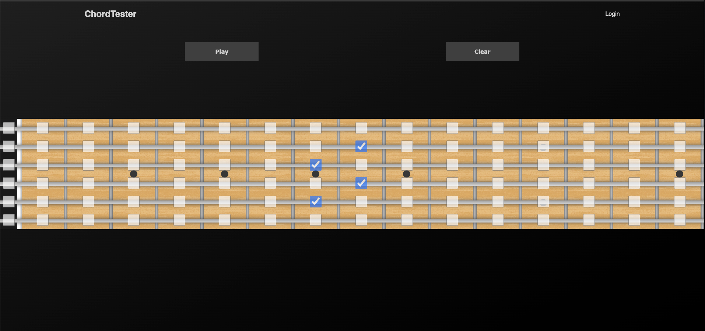
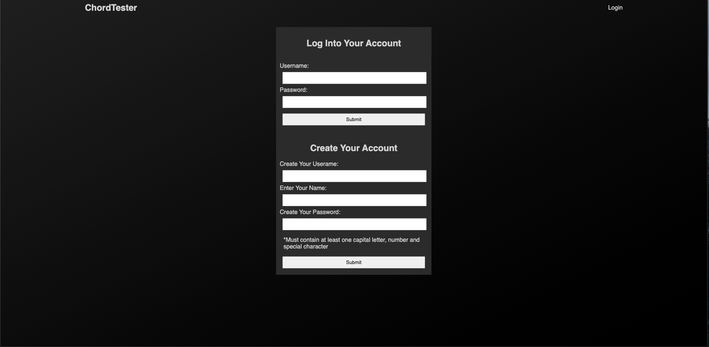
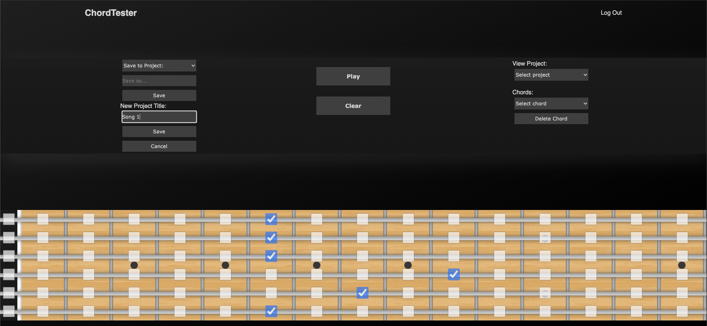
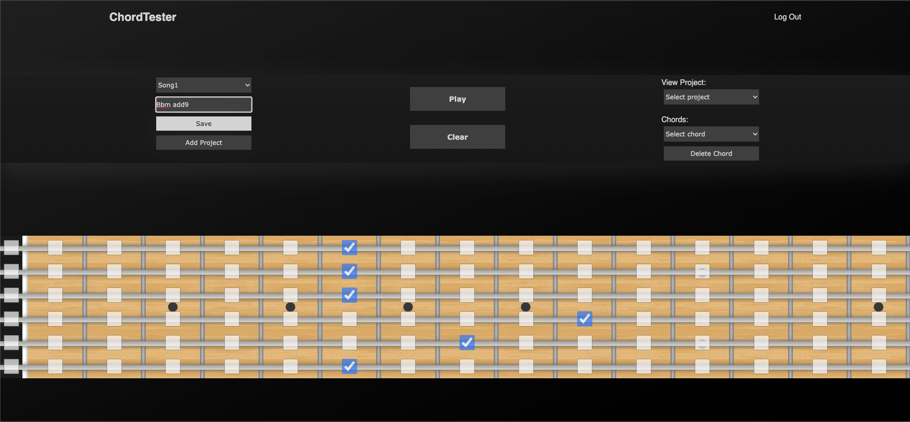
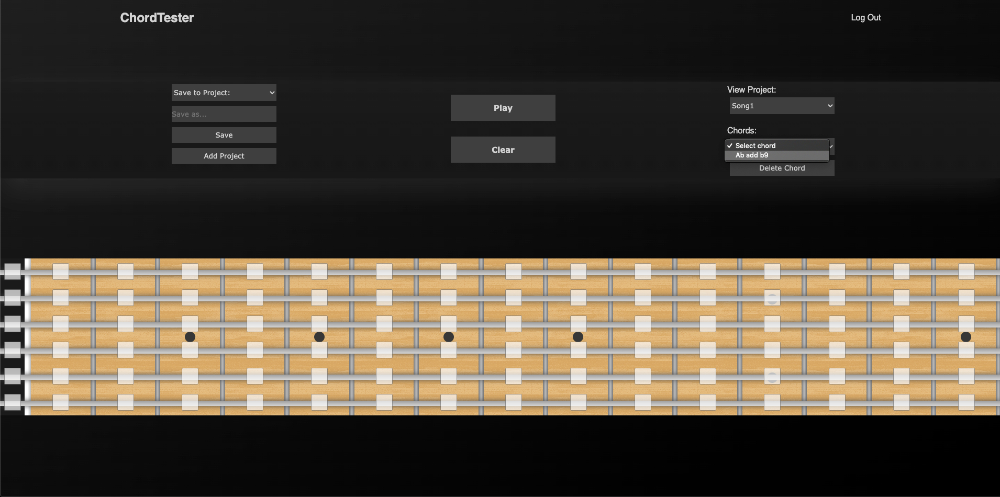

### `ChordTester`

ChordTester is a simple web app which allows musicians on the go to test out chord voicings without their instrument. The simple user interface makes it easy to jump in and experiment without having to contend with a learning curve.

If a user holds an account, they are able to save their chords into project folders and retrieve them, which automatically repopulates the fretboard with their saved chord. This is a great way to "take notes" if the user has a spark of inspiration but no access to their instrument.

### `The UI`

Before logging in, you are greeted by the fretboard, a play button and a clear button. Simply check the boxes and press `Play` to hear the chord. Press `Clear` to clear the fretboard.

### `Account Page`

ChordTester offers users access to a free account to keep track of their projects. To create an account, a user needs only to enter their name and create a username and password. 

### `The UI, Logged In`

Once a user has logged in, they are taken back to the home page, which now includes menus to manage their projects.

### `Creating Project Folders`

The menus on the left allow the user to manage their projects. To create a project folder, click on `Add Project` to expose the Add Project menus. Type in the desired name of the project folder into the text box and click `Save`.

### `Save Chord to Project`

To save the currently displayed chord to a project, select the desired project folder from the upper left menu, type the chord name into the text box and click `Save`. This chord will then be available in the specified project folder, which can be accessed by the menus on the right.

### `Selecting Chords from Projects`

The menus on the right allow users to access their saved chords. Simply select a project from the upper menu, and select a chord from that project from the lower menu. The fretboard is populated with the notes from the selected chord, and the user can play back the chord. To delete the chord from the project, click `Delete Chord` while the chord is selected.

